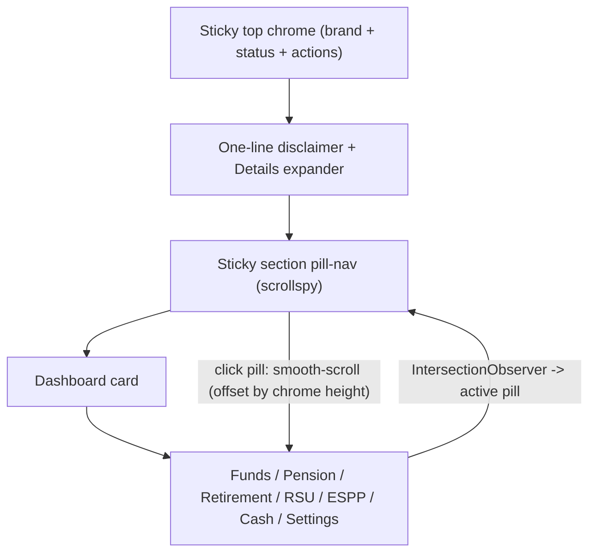

# Design: Compact Top Chrome + Section Navigation

Date: 2026-07-16
Status: Approved (pending spec review)
Scope: Frontend only (`frontend/index.html`, `frontend/i18n.js`). No backend or deploy changes.

## Problem

The app is a single-page vertical scroll of eight stacked `.card` sections
(Dashboard, Funds, Pension, Retirement simulator, RSU, ESPP, Cash, Settings) in
[frontend/index.html](../../../frontend/index.html).

Two UX issues:

1. **No navigation.** There is no persistent way to move between sections; every
   trip to RSU/ESPP/Cash is a scroll hunt, worse on mobile and in RTL Hebrew.
2. **Heavy above-the-fold.** On every load the order is hero (`h1` + long
   subtitle) -> a 7-bullet "Important - read before using" disclaimer aside
   (`disclaimer-banner`) -> status bar -> only then the Dashboard total. The
   disclaimer is important for a personal finance tool and must stay accessible,
   but it should not bury the dashboard on every visit.

## Goals

- Let the user reach any section in one click, with a clear indication of where
  they are.
- Make the Dashboard total appear near the top of the page on return visits.
- Keep the disclaimer honest and one click away.
- Preserve the existing single-page model: the Dashboard Chart.js instance,
  per-section add panels, and existing JS wiring all assume sections coexist in
  the DOM. No section is removed from the DOM.
- No backend changes; reuse the existing i18n and `localStorage` patterns.

## Non-goals

- Converting to a true tabbed SPA (one section at a time).
- Mobile density rework, cold-start skeletons, actionable empty states, or the
  allocation overview (these are separate, later findings).

## Architecture

Above-the-fold, return visit, top to bottom:

1. Thin sticky top chrome: compact brand + status pill + actions
   (lang / AI chat / theme / refresh / sign-out).
2. One-line disclaimer notice with a "Details" expander.
3. Sticky section pill-nav.
4. Dashboard card.

## Component 1: Section pill-nav

- New `<nav>` inserted after the top chrome and before the Dashboard card,
  rendered sticky as part of the combined top chrome (see "Sticky behavior").
- One pill per existing section card, keyed to the card id:
  `dashboard-card`, `funds-card`, `pension-card`, `retirement-simulator-card`,
  `rsu-card`, `espp-card`, `cash-card`, `settings-card`.
- Labels reuse existing `section.*` i18n keys.
- Count badges on holding sections, sourced from the count spans already
  maintained in the DOM: `funds-count`, `pension-count`, `rsu-count`,
  `espp-count`, `cash-count` (all `class="h2-count"`). Badge is hidden when the
  count is 0. Dashboard/Retirement/Settings have no badge.
- Interaction:
  - Click a pill -> smooth-scroll to the section, offset by the sticky chrome
    height so the section heading is not hidden beneath the sticky bar.
  - Respect `prefers-reduced-motion` (fall back to instant scroll).
  - Scrollspy via `IntersectionObserver`, with `rootMargin` compensating for the
    sticky chrome height, highlights the active pill; set `aria-current="page"`
    on it.
  - Pills are `<button>`/`<a>` elements in a labeled nav; keyboard focusable in
    document order.
- Mobile: horizontally scrollable pill strip (`overflow-x:auto`, scroll-snap),
  no wrap; active pill auto-scrolled into view. Layout mirrors for RTL via the
  document `dir`.

## Component 2: Compact hero + collapsible disclaimer

- Hero shrinks to a single compact brand line. The long subtitle moves into the
  expandable area / help and is not shown on every visit.
- Disclaimer:
  - Compact one-liner, e.g. "Personal tool - not financial advice - Details",
    with a toggle button (`aria-expanded`) that expands the full existing
    7-bullet content inline.
  - All current disclaimer `data-i18n` keys and content are preserved and remain
    in the DOM (accessibility / no content loss).
  - First visit (no `st_disclaimer_ack` in `localStorage`): render expanded, with
    a "Got it" button inside the expanded panel. Clicking it sets
    `st_disclaimer_ack` and collapses to the one-liner.
  - Return visits (flag present): render collapsed one-liner only.
  - A persistent "Details" control (and/or footer link) always reopens the full
    text.

## Sticky behavior (confirmed decision)

Combine the existing status bar and the pill-nav into one thin sticky top unit
(`position: sticky; top: 0`) so the actions (refresh / AI chat / theme / lang /
sign-out) remain reachable while scrolling. The measured height of this unit
feeds the smooth-scroll offset and the scrollspy `rootMargin`.

## Data flow & persistence

- Pure frontend. No API or schema changes.
- `localStorage` keys follow the existing `st_*` convention (`st_theme`,
  `st_lang`); add `st_disclaimer_ack`.
- i18n: reuse the existing `data-i18n` system. New strings in
  [frontend/i18n.js](../../../frontend/i18n.js), both `en` and `he`:
  `disclaimer.compact`, `common.details`, `common.gotIt`. Pills reuse `section.*`.

## Edge cases

- Logged-out state: the sticky chrome and pill-nav must not show over the login
  overlay; they appear only once the app is authenticated and `#app-main` is
  visible.
- Light/dark theming of pills, badges, and the sticky chrome background
  (with a subtle backdrop) for both themes.
- Scrollspy at the bottom of the page and for short sections: ensure the last
  section can become active even if it cannot scroll to the top of the viewport.
- Keyboard: logical focus order, visible focus states, `aria-current` on the
  active pill, `aria-expanded` on the disclaimer toggle.
- RTL: pill order and horizontal scroll mirror correctly.

## Testing / verification (manual, no deploy)

- Each pill scrolls to the correct section with the heading visible below the
  sticky chrome.
- Active pill updates correctly while scrolling, including at the page bottom.
- Mobile: pill strip scrolls horizontally; active pill scrolls into view.
- RTL Hebrew: layout mirrored; scroll and highlight still correct.
- Disclaimer: first visit expanded -> "Got it" collapses and persists across a
  reload; Details toggle expands/collapses; content intact in both languages.
- Light and dark themes both render correctly.

## Files

- `frontend/index.html` - markup for the combined sticky chrome + pill-nav +
  compact disclaimer; CSS; JS for smooth-scroll, scrollspy, and disclaimer
  toggle + persistence.
- `frontend/i18n.js` - new strings (en + he).
